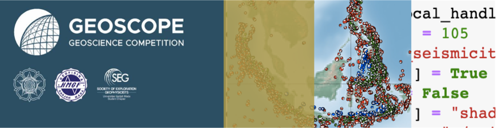

# Geoscope Geohazard Workshop HMGF UGM
## *"Applied Python for Better Geohazard Information"*

**Instruktur:**
Dr.rer.nat. Wiwit Suryanto, M.Si

Anang Sahroni, S.Si

**Waktu:**  
Sesi 1: 13 Februari 2021  
Sesi 2: 20 Februari 2021  
Sesi 3: 27 Februari 2021  

**Tempat:**
Zoom Meeting

**Agenda:**
Pengenalan bahasa pemrograman Python dan aplikasinya untuk *geohazard*, khususnya gempa bumi. Penjelasan materi tidak dilakukan menggunakan metode *fiture by fiture* melainkan peserta akan diajak mengenali Python dalam wujud pembelajaran *learning by doing* dengan bermain menggunakan data asli.

## Luaran
1. Peserta dapat melakukan instalasi Python
2. Peserta dapat membuat Jupyter Notebook dan menyimpan dalam repositori Github masing-masing
3. Peserta dapat membaca, memfilter, dan mengeplot peta dan statistik gempa bumi menggunakan modul umum Python seperti `numpy`, `scipy`, dan `matplotlib`
4. Peserta dapat menggunakan modul spesifik Python (`ObspyDMT`) [(Kasra Hosseini)](https://github.com/kasra-hosseini/obspyDMT) untuk mengetahui seismisitas dan mengunduh data rekaman gempa bumi.

## Peralatan untuk peserta
Laptop ataupun *Personal Computer* (PC) yang terkoneksi dengan internet.

## Data:
1. Katalog Gempa Bumi United States of Geological Survey (USGS)
2. Titik-titik Stasiun untuk berbagai jaringan seismometer

## Jadwal
| **Topik** |
|:-----------|
| **SESI 1: 13 Februari 2021** |
| *Instalasi Python dalam Miniconda* |
| 1. Instalasi Miniconda pada Windows, Linux, ataupun MacOS |  
| 2. Menjalankan Python Console melalui Anaconda Prompt |  
| 3. Menulis kode dalam editor (Integrated Development Environment/IDE) kode dan menjalankannya melalui Anaconda Prompt
| 4. Pengenalan IDE dan beberapa contohnya
| 5. Menginstall dan menjalankan Jupyter Notebook
| 6. Menjalankan kode sederhana di Jupyter Notebook
| 7. Memanggil fungsi bawaan python (`math`), mencoba, dan memanggil bantuan (`help`) untuk masing-masing fungsi
| 8. Memberikan catatan dan gambar dalam bentuk `Markdown` di Jupyter Notebook
| 9. Menyimpan notebook pada repositori Github dan menambahkan ke Binder
| 10. Mengupdate notebook dan melakukan commit ke repositori
| **EXERCISE:** Membuat panduan instalasi Miniconda pada Jupyter Notebook dan menambahkannya di repositori Github individu. |
||
| **SESI 2: 20 Februari 2021** |
| *Materi Dasar Python* |
| 1. Membuat dan mengaktifkan *virtual environment* (opsional) |
| 2. Menginstall `numpy`, `matplotlib`, `scipy`, `basemap`, dan `notebook` menggunakan Anaconda Prompt pada *virtual environment* |
| 3. Membaca data katalog menggunakan `numpy` |
| 4. Membedakan jenis-jenis data antar kolom pada katalog (`String`, `Integer`, dan `Float`) |
| 5. Mengambil salah satu kolom ke dalam bentuk `List` dan mempelajari metode-metode pada `List` (`indexing`, `slicing`, `append`, dan lain sebagainya) |
| 6. Menggunakan `for` *loop* untuk mengkonversi format `String` menjadi `datetime` untuk waktu kejadian |
| 7. Menggunakan `conditional` untuk memfilter katalog berdasarkan besar magnitudo atau waktu |
| 8. Membuat fungsi untuk memfilter katalog berdasarkan kedalaman dan menyimpannya menjadi modul siap impor |
| 9. Membuat plot magnitudo dengan jumlah kejadian dan waktu kejadian (dapat berupa G-R Plot atau plot sederhana) |
| 10. Mengkombinasikan `List` latitude dan longitude untuk mengeplot episenter |
| 11. Mengintegrasikan kolom magnitude untuk membedakan ukuran titik titik plot |
| 12. Mengintegrasikan kolom kedalaman untuk membedakan warna titik plot |
| 13. Menambahkan *basemap* pada plot Menggunakan `Matplotlib Basemap` |
| 14. *Gridding*, Interpolasi, dan membuat kontur kedalaman menggunakan `scipy` (opsional) |
| **EXERCISE:** Membaca file titik stasiun, memfilter berdasarkan network, dan mengeplotnya bersama dengan titik-titik gempa. |
||
| **SESI 3: 27 Februari 2021** |
| *Menggunakan ObspyDMT* |
| 1. Menginstall ObspyDMT pada *virtual environment* baru |
| 2. Membuat konfigurator awal dalam bentuk `Dictionary` untuk mengunduh katalog pada ObspyDMT |
| 3. Mengunduh katalog gempabumi menggunakan `event_handler` ObspyDMT |
| 4. Mengeplot episenter gempa menggunakan `local_handler` pada ObspyDMT |
| 5. Mengeplot mekanisme fokal dan statistik sederhana gempabumi pada `event_handler` ObspyDMT |
| 6. Membuat plot ray antara titik episenter dan lokasi  stasiun menggunakan `local_handler` obspyDMT |
| 7. Mengunduh data rekaman untuk waktu tertentu menggunakan `data_handler` ObspyDMT |
| 8. Melakukan koreksi instrumen untuk data rekaman yang sudah diunduh menggunakan `local_handler` ObspyDMT |
| 9. Membuat User Interface (UI) sederhana untuk *query* katalog dan mengeplot hasilnya menggunakan `Panel` (opsional) |
| **EXERCISE**: Membuat Plot Seismisitas untuk daerah asal peserta |
||
| **PENGAYAAN MANDIRI** |
| *Melakukan Deterministic Sesimic Hazard Analysis (DSHA) Menggunakan `Openquake`* |
| 1. Menghitung parameter-parameter untuk sumber gempa menggunakan `Hazard Modelling Toolkit (hmtk)` |
| 2. Membaca data patahan dan mengintegrasikan dengan parameter sumber yang sudah dibuat |
| 3. Membaca data Vs30 |
| 4. Menjalankan DSHA dan mengeplot hasilnya |

## Software untuk diinstall
1. **Miniconda**. Instalasi Python akan dilakukan menggunakan Anaconda Distribution dalam bentuk *lite* yaitu Miniconda. Dengan Miniconda instalasi paket atau modul pendukung untuk Python akan lebih mudah dan tertata. [Unduh installer Miniconda](https://docs.conda.io/en/latest/miniconda.html), pilih untuk versi Python 3.8.
2. Editor teks agar penulisan kode lebih mudah karena biasanya sudah disertai pewarnaan kode  (*syntax highlighting*) dan indentasi otomatis. Editor teks dapat menggunakan **Notepad++**, **SublimeText**, atau menggunakan IDE yang lebih kompleks seperti **PyCharm** dan **Visual Studio Code**.

Software-software yang dibutuhkan tersebut **sudah harus diunduh (paling tidak) sebelum proses pemberian materi dimulai** karena ukurannya cukup besar.

## Akun Github
Peserta workshop dianjurkan mendaftarkan akun GitHub melalui [Daftar Github](http://github.com)

## Bacaan Tambahan:
Peserta dapat belajar pada Lesson di [Software Carpentry](https://software-carpentry.org/lessons/) dengan materi yang mendalam dan metode yang sama yaitu learning by doing. 

## *Acknowledgment*
Panduan ini disusun terinspirasi dari materi pada [Software Carpentry](https://software-carpentry.org/lessons/) dan panduan workshop Leonardo Uieda yang diunggah pada [repositori](https://github.com/leouieda/python-hawaii-2017) berikut ini.

## Lisensi
Konten di repositori ini berada di bawah lisensi:
[Creative Commons Attribution 4.0 International License][cc-by].

[![CC BY 4.0][cc-by-image]][cc-by]

[cc-by]: http://creativecommons.org/licenses/by/4.0/
[cc-by-image]: https://i.creativecommons.org/l/by/4.0/88x31.png
[cc-by-shield]: https://img.shields.io/badge/License-CC%20BY%204.0-lightgrey.svg
